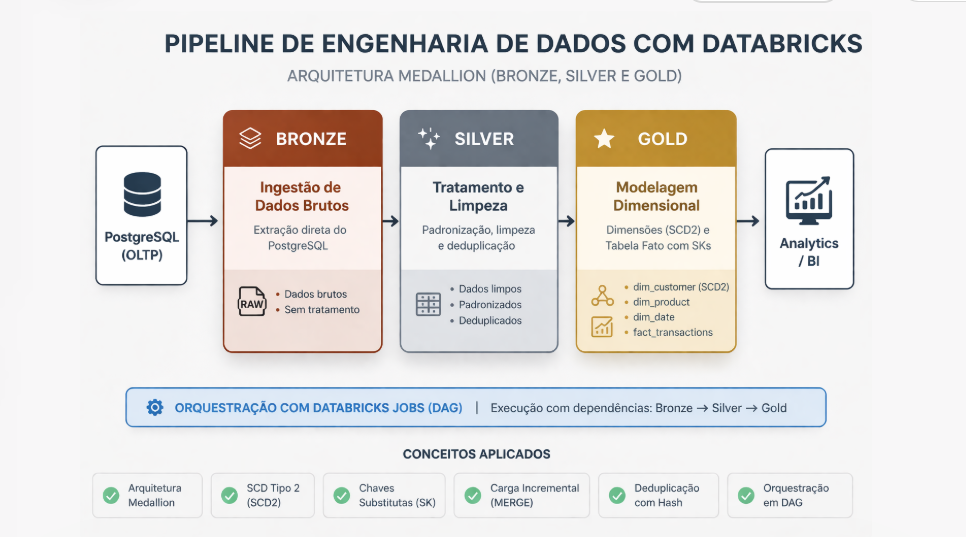
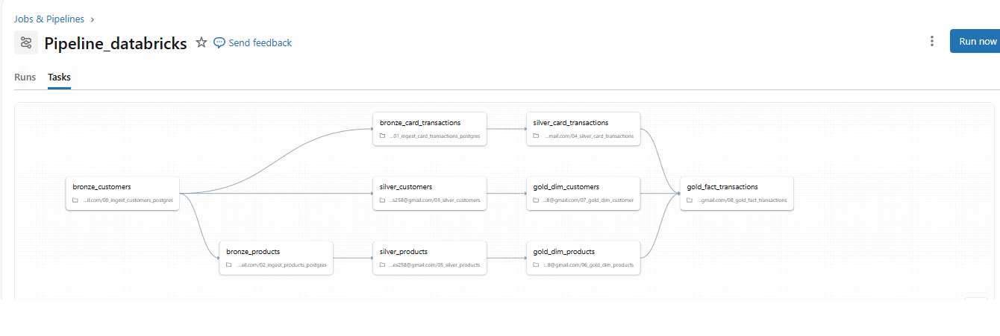

# Pipeline de Engenharia de Dados com Databricks | Arquitetura Medallion


<p align="center">
  
</p>

---

## Orquestração do Pipeline (DAG)

Pipeline orquestrado no Databricks com dependências entre camadas Bronze, Silver e Gold, garantindo execução sequencial e consistência dos dados.

<p align="center">
  
</p>

---

## Visão Geral

Pipeline completo de engenharia de dados com Databricks, incluindo ingestão, transformação, modelagem dimensional (SCD Tipo 2) e orquestração com DAG.

Os dados são ingeridos a partir de um banco PostgreSQL, tratados e transformados, culminando em um modelo dimensional robusto com SCD Tipo 2 e construção de tabela fato.

---

## Arquitetura

* **Bronze**: Ingestão de dados brutos do PostgreSQL
* **Silver**: Limpeza, padronização e deduplicação
* **Gold**:

  * Dimensões (com SCD Tipo 2)
  * Tabela fato com chaves substitutas (Surrogate Keys)

---

## Tecnologias Utilizadas

* Databricks (Delta Lake)
* PySpark / SQL
* PostgreSQL (fonte de dados)
* Delta Tables
* Databricks Workflows (Jobs)

---

## Configuração

Credenciais sensíveis (como conexão com banco de dados) foram removidas do código.

Para execução, é necessário configurar:

* JDBC URL
* Usuário e senha do banco
* Parâmetros via widgets ou variáveis de ambiente

---

## Estrutura do Projeto

```
src/
  bronze/   → ingestão de dados com PySpark
  silver/   → transformação e limpeza com SQL
  gold/     → modelagem dimensional (dimensões e fato)

docs/
  databricks_img.png
  pipeline_dag.png
```

---

## Fluxo do Pipeline

1. Ingestão de dados do PostgreSQL → Bronze
2. Transformação e limpeza → Silver
3. Construção das dimensões (SCD Tipo 2) → Gold
4. Construção da tabela fato com chaves substitutas
5. Orquestração com dependências via Databricks Jobs

---

## Conceitos Aplicados

* Arquitetura Medallion
* Slowly Changing Dimension Tipo 2 (SCD2)
* Chaves substitutas (Surrogate Keys)
* Carga incremental com MERGE
* Deduplicação com hash
* Orquestração em DAG

---

## Modelo de Dados

### Tabela Fato

* customer_sk
* date_sk
* product_sk
* price
* transaction_hash

### Dimensões

* dim_customer (SCD Tipo 2)
* dim_product
* dim_date

---

## Orquestração

O pipeline é orquestrado utilizando Databricks Jobs, com dependências entre tarefas garantindo a execução sequencial das camadas Bronze, Silver e Gold.

Cada etapa do pipeline é executada somente após a conclusão da anterior, assegurando consistência e integridade dos dados.

---

## Decisões Técnicas

* Uso de PySpark na camada Bronze para ingestão de dados
* Uso de SQL nas camadas Silver e Gold para transformação e modelagem
* Implementação de SCD Tipo 2 na dimensão de clientes
* Uso de surrogate keys para integridade dimensional
* Carga incremental baseada em timestamp
* Deduplicação utilizando hash

---

## Destaques

* Pipeline completo de ponta a ponta
* Modelagem dimensional consistente
* Uso de boas práticas de engenharia de dados
* Estrutura escalável e organizada
* Otimização de desempenho com ZORDER nas tabelas dimensionais
* A tabela fato utiliza uma chave técnica baseada em hash para evitar duplicidade de registros durante cargas incrementais

---

## Melhorias Futuras

* Uso de parâmetros seguros (secrets)
* Validação de qualidade de dados
* Integração com ferramentas de BI

---

## Autor

Manoel Alexandre Peres
